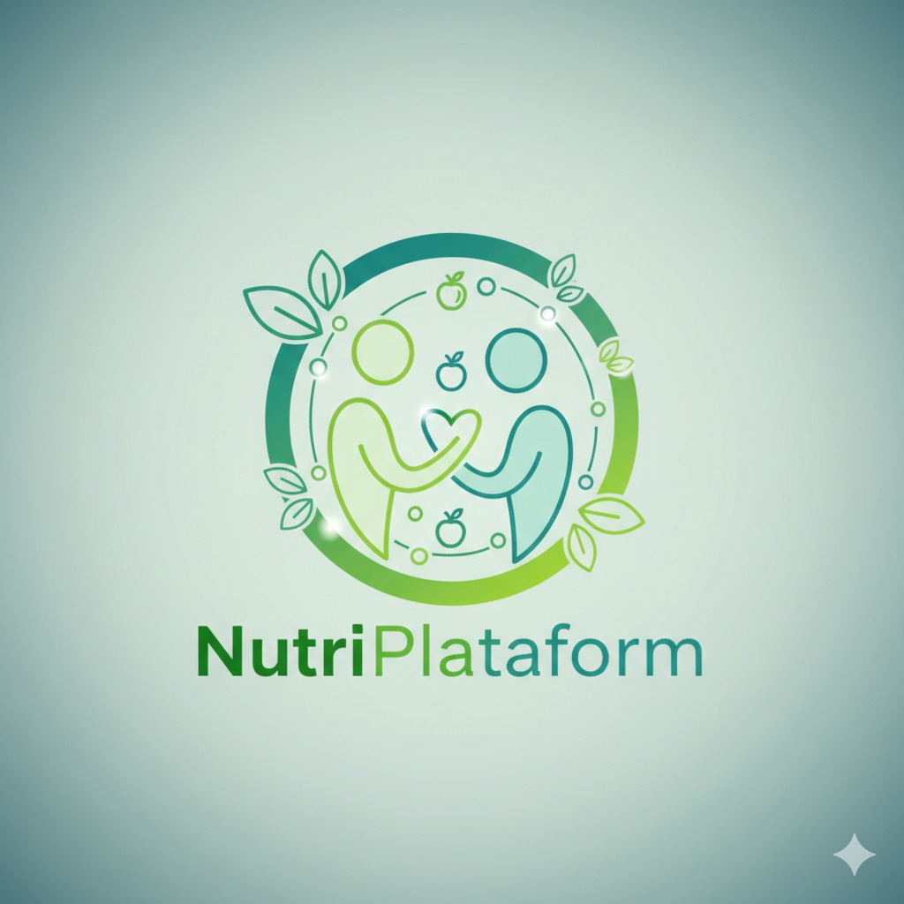

# 🥗 Nutri-Platform

<div align="center">
  
</div>

Sistema completo de gestão nutricional conectando clientes e nutricionistas através de contratos, planos alimentares personalizados e acompanhamento de progresso.

## 🎯 Visão Geral

**Nutri-Platform** é uma aplicação fullstack moderna que facilita a conexão entre nutricionistas e clientes, oferecendo uma plataforma integrada para:

- **Contratos Inteligentes**: Sistema automatizado de propostas e aceites
- **Planos Alimentares**: Criação e gestão de cardápios personalizados
- **Acompanhamento**: Monitoramento de progresso e evolução nutricional
- **Base de Alimentos**: Catálogo completo com informações nutricionais

## 🚀 Stack Tecnológica

- **Frontend**: Next.js 15 + TypeScript + Tailwind CSS + ShadCN/UI
- **Backend**: Express.js + TypeScript + Prisma ORM
- **Banco**: PostgreSQL
- **Deploy**: Vercel (frontend) + Render (backend)
- **Auth**: JWT + Context API

## 📚 Documentação

Para informações técnicas detalhadas, consulte:

- **[API Reference](docs/API.md)** - Endpoints, autenticação e exemplos de uso
- **[Arquitetura](docs/ARCHITECTURE.md)** - Decisões técnicas e padrões
- **[Deploy](docs/DEPLOYMENT.md)** - Guias de deploy e configuração

## ✨ Funcionalidades

### Autenticação e Segurança
- Sistema completo de login/registro com JWT
- Proteção de rotas baseada em roles
- Validação de dados com Zod
- Hash de senhas com bcryptjs

### Para Clientes
- [x] Perfil pessoal com dados antropométricos e objetivos
- [x] Busca e visualização de nutricionistas
- [x] Visualização de planos alimentares personalizados
- [x] Registro e acompanhamento de progresso
- [x] Contratação direta de nutricionistas (planejado)
- [ ] Sistema de mensagens (planejado)

### Para Nutricionistas
- [x] Perfil profissional (CRN, especialidades, preços)
- [x] Listagem pública de nutricionistas
- [x] Gestão de clientes via contratos
- [x] Criação e edição de planos alimentares completos
- [x] Catálogo de alimentos com informações nutricionais
- [x] Acompanhamento de progresso dos clientes
- [ ] Sistema de mensagens (planejado)

### Sistema de Contratos
- [x] Gestão completa de contratos cliente-nutricionista
- [x] Status: ACTIVE, PAUSED, CANCELLED, COMPLETED
- [x] Controle de vigência e preços
- [x] Vinculação com planos alimentares

## 🛠️ Configuração Local

### Pré-requisitos
- Node.js 18+
- PostgreSQL 14+
- Git

### 1. Clone e Setup

```bash
# Clone o repositório
git clone https://github.com/soumbra/nutri-platform.git

# Instalar dependências
npm run install:all

# Configurar ambiente
cp .env.example .env.local
# Edite as variáveis de ambiente

# Executar em desenvolvimento
npm run dev
```

🔗 **Deploy**: [nutri-platform.vercel.app](https://nutri-plataformx.vercel.app/)

## 🤝 Contribuição

1. Fork o projeto
2. Crie sua branch (`git checkout -b feature/MinhaFeature`)
3. Commit (`git commit -m 'Add: nova feature'`)
4. Push (`git push origin feature/MinhaFeature`)
5. Abra um Pull Request

---

**Desenvolvido por** [soumbra](https://github.com/soumbra) • **Licença** MIT
